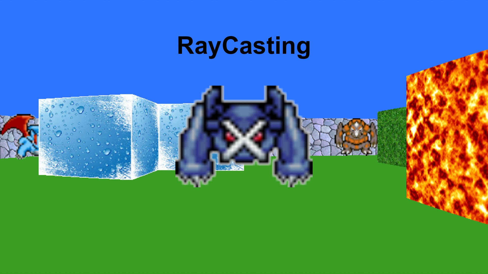
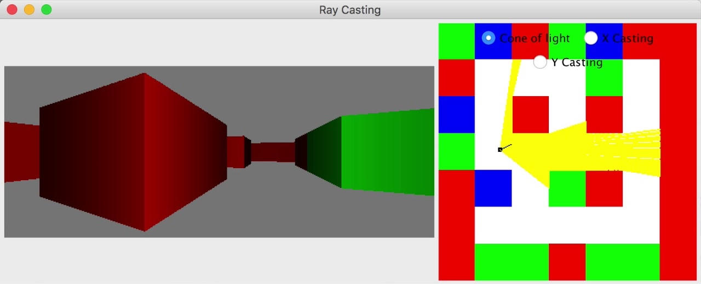
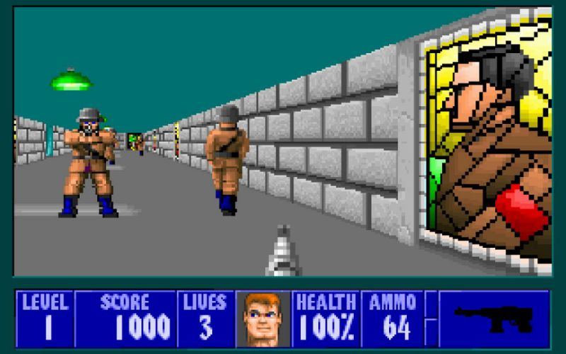

# RayCasting

RayCasting is a rendering technique that transforms 2D data into 3D simulation, while requiring very little computing power. Because of this particularity, this system was a real success in the early 1990s, when the computers and game consoles of the time could not use modern 3D rendering techniques because of a lack of sufficient power.

This is because a RayCasting engine needs, in its simplest version, only two data :

• An array containing the list of the different walls of the game.
• A "Player", defined by a position (2D) and orientation.

The purpose of the engine is to launch, for each column of pixels to be displayed on the screen, a ray starting from the player and stopping at the first wall encountered. Once this wall is reached, it is sufficient to draw a vertical line representing it, the size of which is proportionally inverted to the distance covered by the radius. Indeed, the greater the distance, the further away the wall is from the player, and must appear small to the player. By using this technique on each column of pixels on the screen, it is possible to get a complete overview of the environment as it is perceived by the player.

This process corresponds to the heart of the game engine, and is sufficient to make it work. On the other hand, there are many improvements to make it a little more interesting…

First of all, you will notice that RayCasting simply displays each block in a unique color, so that it can be distinguished from the floor and the sky. It is possible to replace these plain colours with textures, in order to give a more realistic appearance to the walls. Then, the original engine does not allow jumping or bending down, but we can modify this by adapting the vertical position of each block, and calculating each projection beyond the first block encountered. Finally, an interesting feature is the addition of a sprite system, which allows you to have enemies moving between blocks, like in a real video game.

Of course, these are only avenues for improvement, and it is now possible to find implementations of this engine that have much more advanced features. But it should not be forgotten that it was the original version of RayCasting that allowed 3D to make its first steps into the world of video games, thanks in particular to the success of [Doom](https://store.steampowered.com/app/2280/Ultimate_Doom/) and [Wolfenstein 3D](https://store.steampowered.com/app/2270/Wolfenstein_3D) !

To conclude, since this engine is more than 30 years old, many official developments have been made, including RayTracing technology. It is a projection identical to RayCasting, but which projects each pixel on the screen, and no longer only each row, in order to determine with incomparable precision the color of each pixel. Today, this technology is one of the most important in terms of realism, but requires very powerful computers to be used, which hinders its adoption by the general public.

While waiting for the future 3D rendering technologies that will revolutionize video games and computing in the coming years, don't forget to try my RayCasting engine !